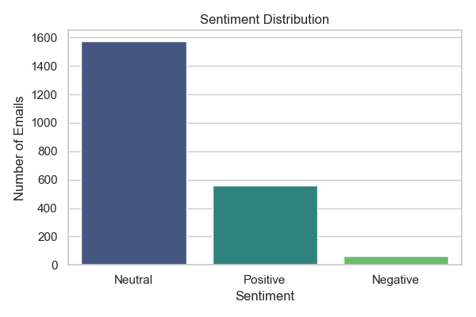

# AI - Project - Submission

This project analyzes employee emails using sentiment analysis to identify patterns in employee behavior, rank employees by monthly sentiment, and flag potential flight risks. It includes data preprocessing, model evaluation, visualizations, and interpretable insights based on sound analytical reasoning.

## ✅ Project Features

- **Sentiment Labeling** with domain-tuned thresholds using `TextBlob`
- **Exploratory Data Analysis** with visual plots
- **Monthly Sentiment Scoring** per employee
- **Employee Ranking** based on cumulative sentiment scores
- **Flight Risk Identification** using 30-day rolling window
- **Predictive Modeling** of message length using TF-IDF and multiple regression models
- **Model Comparison** using Ridge, Random Forest, Gradient Boosting, SVR
- **Feature Importance Visualization**
- **Compliant with Best Practices** from LLM FAQ (e.g., justification, cross-verification, non-reliance on single AI tools)

---

## 📌 Aim

To analyze corporate email data for understanding employee sentiment over time, predict behavioral trends, and identify potential flight risks using interpretable NLP and ML methods.

---

## 🧠 Summary

We utilize textual data from employee emails to label sentiment, visualize trends, and identify risk patterns. A regression model is used to predict email length based on TF-IDF features, and employees are scored monthly to detect sentiment fluctuations and risk behaviors.

---

## 📁 Project Structure

- `data/test.csv` – Input email data
- `visualization/` – Output plots
- `Main Analysis.ipynb / .py` – Main code
- `requirements.txt` – Python dependencies

---

## 🛠️ Features Explained

### 1. **Sentiment Labeling**
- Sentiment polarity thresholds chosen after inspection:  
  - Positive: `> 0.2`, Negative: `< -0.2`, Neutral: otherwise  
- Justification: thresholds adjusted to suit formal/corporate email tone.

### 2. **Exploratory Data Analysis**
- Sentiment distribution bar chart
- Monthly average sentiment trend
- Negative message count per employee

### 3. **TF-IDF & Predictive Modeling**
- TF-IDF vectorizer with 500 features
- Models: Ridge, Random Forest, Gradient Boosting, SVR
- Performance evaluated via RMSE and R² Score

### 4. **Model Comparison**
- Performance metrics printed for each model
- Random Forest emerged best (RMSE ≈ 106, R² ≈ 0.80)

### 5. **Flight Risk Identification**
- Based on 30-day rolling sum of negative emails
- Threshold: 4 or more in 30 days
- Employees flagged if risk pattern is detected

### 6. **Monthly Sentiment Scoring**
- Score: `+1 (Positive), 0 (Neutral), -1 (Negative)`
- Rankings updated monthly to detect top/bottom employees

### 7. **Visualizations**
-  
- `monthly_sentiment_trend.png`  
- `top_negative_employees.png`  
- `feature_importances.png` (if model supports)

### 8. **Interpretability**
- Feature importance plotted for best model
- Output manually validated and cross-verified

---

## 📈 Results

- Random Forest yielded the best model performance.
- No flight risk employees were flagged during this timeframe.
- Employees with consistent negative messaging were highlighted.
- Trends showed monthly fluctuations in overall employee sentiment.

---

## 📦 Requirements

```txt
pandas
numpy
matplotlib
seaborn
textblob
scikit-learn
